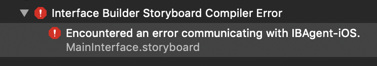

# GetLaid

GetLaid is a lean framework for defining complex view layouts through elegant code.

## Features

Some advantages even over classic simple frameworks like [PureLayout](https://github.com/PureLayout/PureLayout):

* :white_check_mark: Readability
    - Functions are of the principle form "constrain [constrained aspect] to [constraining aspect]"
    - This semantic naming makes auto completion more valuable: If you want to constrain the left side, write `constrainLeft`. Auto completion will show all possible ways to do it.
    - All functions have the prefix `constrain` which expresses best what they really do: They constrain some attributes and return the resulting constraints.
    - PureLayout is much more convoluted with its 6 different function prefixes: `autoPin`, `autoAlign`, `autoMatch`, `autoCenter`, `autoSet` and `autoConstrain`.
* :white_check_mark: Brevity
    - Shorter lines of code with less function arguments (see comparison below)
* :white_check_mark: Applicable to Layout Guides
    - [UILayoutGuide](https://developer.apple.com/documentation/uikit/uilayoutguide)
    - [NSLayoutGuide](https://developer.apple.com/documentation/appkit/nslayoutguide)
* :white_check_mark: Easy Relative Layouting
    - Relative positioning: `item1.constrainLeft(to: 0.2, of: item2)`
    - Relative sizing: `item1.constrainWidth(to: 0.3, of: item2)`
    - Aspect ratio: `item.constrainAspectRatio(to: 16/9)`
* :white_check_mark: Easy Positioning of Items Next to Each Other
    - `item1.constrain(above: item2, gap: 10)`
    - `item1.constrain(toTheLeftOf: item2)`
* :white_check_mark: Modern Swift Under the Hood
    - No Objective-c
    - Extensive use of [Layout Anchors](https://developer.apple.com/documentation/uikit/nslayoutanchor)

## Why AutoLayout Wrappers?

Programmatic AutoLayout without any such frameworks was never hard. It's all about creating objects of `NSLayoutConstraint`, which has only one [powerful initializer](https://developer.apple.com/documentation/uikit/nslayoutconstraint/1526954-init).

Since iOS 9.0 and macOS 10.11, we also have `NSLayoutAnchor`, which adds a native abstraction layer on top of `NSLayoutConstraint`, further reducing the need for any AutoLayout wrappers at all.

At this point, all an AutoLayout wrapper can do is making the code even more meaningful, readable and succinct at the point of use. GetLaid does exactly that and a few other tiny things.

## Why Not Other AutoLayout Wrappers?

Modern AutoLayout wrappers like [SnapKit](https://github.com/SnapKit/SnapKit) are almost too clever for the simple task at hand. A SnapKit example:

~~~swift
box.snp.makeConstraints { (make) -> Void in
    make.width.height.equalTo(50)
    make.center.equalTo(self.view)
}
~~~

Classic AutoLayout wrappers like [PureLayout](https://github.com/PureLayout/PureLayout), have easier syntax but are still wordy:

~~~swift
box.autoSetDimensions(to: CGSize(width: 50, height: 50))
box.autoCenterInSuperView()
~~~

GetLaid trims AutoLayout code even further down to the essence. Compare for yourself:

### Before (PureLayout)

~~~swift
item1.autoPinEdgesToSuperviewEdges()
item1.autoPinEdge(toSuperviewEdge: .top)
item1.autoSetDimension(.width, toSize: 42)
item1.autoPinEdge(.left, to: .left, of: item2)
item1.autoAlignAxis(.vertical, toSameAxisOf: item2)
item1.autoSetDimensions(to: CGSize(width: 82, height: 42))
item1.autoPinEdge(.bottom, to: .top, of: item2, withOffset: -20)
item1.autoSetDimension(.height, toSize: 64, relation: .greaterThanOrEqual)
item1.autoPinEdgesToSuperviewEdges(with: NSEdgeInsetsZero, excludingEdge: .top)
item1.autoConstrainAttribute(.left, to: .right, of: item2, withMultiplier: 0.2)
item1.autoConstrainAttribute(.width, to: .height, of: item1, withMultiplier: 16/9)
item1.autoPinEdgesToSuperViewEdges(with: NSEdgeInsets(top: 10, left: 0, bottom: 0, right: 0))
~~~

### After (GetLaid)

~~~swift
item1.constrainToParent()
item1.constrainTopToParent()
item1.constrainWidth(to: 42)
item1.constrainLeft(to: item2)
item1.constrainCenterX(to: item2)
item1.constrainSize(to: 82, 42)
item1.constrain(above: item2, gap: 20)
item1.constrainHeight(toMinimum: 64)
item1.constrainToParentExcludingTop()
item1.constrainLeft(to: 0.2, of: item2)
item1.constrainAspectRatio(to: 16/9)
item1.constrainToParent(insetTop: 10)
~~~

So, which is prettier, mh?

If you can spare the fancyness but appreciate readability, GetLaid might be for you.

## How to GetLaid

### Installation

GetLaid can be installed as a [Cocoapod](https://cocoapods.org). Add this to your pod file:

~~~ruby
pod 'GetLaid'
~~~

### Contraining Functions

Almost all functions of GetLaid are called on objects of `UIView`, `NSView`, `UILayoutGuide` and `NSLayoutGuide`. Functions that constrain layout items to their parents are only available on the view classes. 

All the constraining functions have the prefix `constrain` and are well discoverable via auto completion.

### Adding Subviews

Remember to set `translatesAutoresizingMaskIntoConstraints = false` on the views you incorporate in auto layout.

The generic function `addForAutoLayout(...)` adds a subview and prepares it for auto layout. It returns the subview as its exact type. I use this function to initialize subview properties:

~~~swift
class List: NSView
{
    override init(frame frameRect: NSRect)
    {
        super.init(frame: frameRect)
        
        header.constrainToParentExcludingBottom()
    }
    
    private lazy var header = addForAutoLayout(Header())
}
~~~

### Adding Layout Guides

There are two helper functions to add new layout guides to views:

~~~swift
let guide = view.addLayoutGuide()
let tenGuides = view.addLayoutGuides(10)
~~~

## Side Note: Why Not Use Interface Builder?

I'm glad you ask! An even better question is: Why would any **professional** use Interface Builder? IB may help to build simple rough prototypes. It is really no option for professional apps.

So here is what you get using the Interface Builder, according to my experience across multiple professional projects:

* :no_entry_sign: The IB is slow. Opening and loading a storyboard usually has a significant delay.
* :no_entry_sign: The IB does not make it obvious where configurations deviate from defaults, i.e. where they have been manipulated by a developer.
* :no_entry_sign: Handleing complex interfaces through pointing, zooming, scrolling and selecting, intertwined with keyboard input is actually pretty fucking slow.
* :no_entry_sign: Algorithmic (dynamic) layouts are impossible. However, often the mere existence of a view is determined at runtime, or layouts depend on data.
* :no_entry_sign: What constraints are actually applied is less explicit, in particular in the context of the code.
* :no_entry_sign: IB files create a mess with collaboration and version control systems like git.
* :no_entry_sign: IB files mess up the architecture I: They entangle the logical definition of the interface (which constitutes something like a "view model") with highly system specific file formats.
* :no_entry_sign: IB files mess up the architecture II: They entangle the logical definition of screen flow (high level navigation) with highly system specific file formats.
* :no_entry_sign: Setting very specific constraints with multipliers etc. and also debugging layout issues are a nightmare with the IB.
* :no_entry_sign: Coding animations often requires to access or even replace constraints. Good luck doing that when using the IB!
* :no_entry_sign: There are more initializers to worry about as well as the general interoperation between code and IB files.
* :no_entry_sign: Communicating with views requires to create outlets, which is actually quite cumbersome.
* :no_entry_sign: Your app will be harder to port to other platforms, even within the Apple universe.
* :no_entry_sign: It is more cumbersome to turn views into reusable custom views when they live in IB files. This also leads to massive view controllers
* :no_entry_sign: You'll encounter a bunch of issues when trying to package IB files into frameworks and Cocoapods.
* :no_entry_sign: Subviews that you want to access are optional outlets. Either you unwrap them everytime or you make them implicitly unwrapped. The latter option is common practice but can (and did in client projects) lead to crashes.
* :no_entry_sign: It is impossible to pass parameters to custom designated initializers of your views and view controllers. This stark limitation can compromise clean design and architecture.
* :no_entry_sign: The Refactor-Rename function in Xcode will not always rename all outlet connections in IB files, leading to crashes. You'll need to reconnect renamed outlets by hand.
* :no_entry_sign: You'll deal with a whole new type of "compilation" error, which is also opaque and hard to debug:
	
* :no_entry_sign: Designing custom view classes through the IB is cumbersome and requires to use IB "designables". Also, IB must recompile your whole project in order to display these designables, which makes the IB performance problems even worse. And `@IB_Designable` is not well documented by Apple:
	